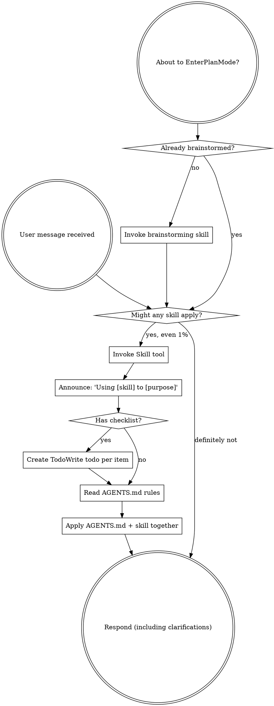

<SUBAGENT-STOP>
If you were dispatched as a subagent to execute a specific task, skip this skill.
</SUBAGENT-STOP>

<EXTREMELY-IMPORTANT>
If you think there is even a 1% chance a skill might apply to what you are doing, you ABSOLUTELY MUST invoke the skill.

IF A SKILL APPLIES TO YOUR TASK, YOU DO NOT HAVE A CHOICE. YOU MUST USE IT.

This is not negotiable. This is not optional. You cannot rationalize your way out of this.
</EXTREMELY-IMPORTANT>

## Instruction Priority

Superpowers skills override default system prompt behavior, but **user instructions always take precedence**:

1. **User's explicit instructions** (AGENTS.md, CLAUDE.md, GEMINI.md, direct requests) — highest priority
2. **Superpowers skills** — override default system behavior where they conflict
3. **Default system prompt** — lowest priority

If AGENTS.md says "always create a plan first" and a skill says "implement directly", follow AGENTS.md. The user is in control.

## How to Access Skills

**In Claude Code:** Use the `Skill` tool. When you invoke a skill, its content is loaded and presented to you—follow it directly. Never use the Read tool on skill files.

**In Copilot CLI:** Use the `skill` tool. Skills are auto-discovered from installed plugins. The `skill` tool works the same as Claude Code's `Skill` tool.

**In Gemini CLI:** Skills activate via the `activate_skill` tool. Gemini loads skill metadata at session start and activates the full content on demand.

**In OpenCode:** Use the `skill` tool. Skills are loaded and presented as content.

**In other environments:** Check your platform's documentation for how skills are loaded.

## Platform Adaptation

Skills use Claude Code tool names. Non-CC platforms: see `references/copilot-tools.md` (Copilot CLI), `references/codex-tools.md` (Codex) for tool equivalents. Gemini CLI users get the tool mapping loaded automatically via GEMINI.md. OpenCode users: substitute native tools (e.g., `todowrite` for `TodoWrite`).

# Using Skills

## The Rule

**Invoke relevant or requested skills BEFORE any response or action.** Even a 1% chance a skill might apply means that you should invoke the skill to check. If an invoked skill turns out to be wrong for the situation, you don't need to use it.



## Red Flags

These thoughts mean STOP—you're rationalizing:

| Thought | Reality |
|---------|---------|
| "This is just a simple question" | Questions are tasks. Check for skills. |
| "I need more context first" | Skill check comes BEFORE clarifying questions. |
| "Let me explore the codebase first" | Skills tell you HOW to explore. Check first. |
| "I can check git/files quickly" | Files lack conversation context. Check for skills. |
| "Let me gather information first" | Skills tell you HOW to gather information. |
| "This doesn't need a formal skill" | If a skill exists, use it. |
| "I remember this skill" | Skills evolve. Read current version. |
| "This doesn't count as a task" | Action = task. Check for skills. |
| "The skill is overkill" | Simple things become complex. Use it. |
| "I'll just do this one thing first" | Check BEFORE doing anything. |
| "This feels productive" | Undisciplined action wastes time. Skills prevent this. |
| "I know what that means" | Knowing the concept ≠ using the skill. Invoke it. |
| "The skill replaces AGENTS.md" | Both apply. Read AGENTS.md separately. |
| "I'll skip AGENTS.md, the skill covers it" | Skills cover DOMAIN, AGENTS.md covers PROCESS. Both needed. |

## Skill Priority

When multiple skills could apply, use this order:

1. **Process skills first** (brainstorming, debugging) — these determine HOW to approach the task
2. **AGENTS.md rules** — consult planning, testing, and workflow rules from the user's AGENTS.md configuration
3. **Implementation skills second** (frontend-design, mcp-builder) — these guide execution
4. **Router skills** (wordpress-router, etc.) — these dispatch to domain sub-skills, loaded as needed

"Let's build X" → brainstorming first, then AGENTS.md planning rules, then implementation skills.
"Fix this bug" → debugging first, then AGENTS.md process rules, then domain-specific skills.

## Applying AGENTS.md Rules

The global AGENTS.md (`~/.config/opencode/AGENTS.md` or project-level `AGENTS.md`) contains process rules that **complement** skill instructions. Skills cover **domain expertise** (how to build a block, how to write tests for a framework). AGENTS.md covers **process structure** (how to plan, how to track tasks, how to run verification).

Before starting implementation from a skill, consult the relevant sections of AGENTS.md:

- **Planning rules** — for multi-step tasks, create a plan file, present it, get approval
- **Task tracking** — update MASTER_TASK.md, track status
- **Testing rules** — apply TDD, run verification loops
- **Session hygiene** — log decisions, write session summaries
- **Tooling gates** — run linters, typecheckers after changes

When AGENTS.md rules conflict with skill instructions, **AGENTS.md wins** (user instructions > skills).

After finishing implementation, run the verification steps from AGENTS.md (linter, typecheck, tests) in addition to any verification the skill specifies.

## Skill Types

**Rigid** (TDD, debugging): Follow exactly. Don't adapt away discipline.

**Flexible** (patterns, router): Adapt principles to context.

The skill itself tells you which.

### Router Skills

Router skills (marked `metadata.category: router`) are a special type of flexible skill that:
- Accept broad inputs (e.g., "work on this WordPress plugin")
- Classify the work via triage
- Dispatch to one or more domain-specific sub-skills
- Combine outputs from multiple sub-skills when needed

Examples: `wordpress-router` (routes to `wp-block-development`, `wp-rest-api`, etc.)

## Project-Aware Skill Discovery

When starting work on a project (or when project scope changes), assess the project's tech stack and domain, then check external skill catalogs for relevant skills not yet installed.

### Available skill catalogs

| Catalog | Skills | Install CLI |
|---------|--------|-------------|
| [antigravity-skills](https://github.com/rmyndharis/antigravity-skills) | ~300 curated skills | `npx @rmyndharis/antigravity-skills` |
| [antigravity-awesome-skills](https://github.com/sickn33/antigravity-awesome-skills) | ~1,555 community skills | `npx antigravity-awesome-skills` |

### When to trigger
- At the start of a session after identifying the project (reading AGENTS.md, package.json, README, etc.)
- When the user mentions a new tech, framework, or domain not yet covered by installed skills
- When a task aligns with a skill category (e.g., "deploy to k8s" → check for k8s skills)

### How to assess
1. Read the project's `AGENTS.md` (or `package.json`, `README.md`, `pyproject.toml`) to identify the tech stack and domain.
2. Compare against installed skills (in `~/.config/opencode/skills/`).
3. For gaps, search both catalogs:
   ```
   npx @rmyndharis/antigravity-skills search <keyword>
   npx antigravity-awesome-skills search <keyword>
   ```
   Or browse via their hosted catalogs:
   - rmyndharis: `CATALOG.md` in repo root
   - sickn33: [https://sickn33.github.io/antigravity-awesome-skills/](https://sickn33.github.io/antigravity-awesome-skills/)
4. For each promising skill, install with:
   ```
   npx @rmyndharis/antigravity-skills install <skill-name>
   npx antigravity-awesome-skills --path ~/.config/opencode/skills/ <skill-name>
   ```
5. Present the user with a summary of what was installed, from which catalog, and why.

### Which catalog to prefer
- **rmyndharis** first: smaller, curated, lower token overhead. Check this one for most needs.
- **sickn33** second: larger community catalog. Use when rmyndharis lacks what you need, or for niche/domain-specific skills (healthcare, compliance, etc.).

### Example
```
Project identified: Opencare (FastAPI, Next.js, PostgreSQL, Docker, React Native)
Installed skills already cover: FastAPI, Next.js, Python, PostgreSQL, React Native
→ Searched rmyndharis: found observability-engineer
→ npx @rmyndharis/antigravity-skills install observability-engineer
→ Searched sickn33: found hipaa-compliance, offline-sync-patterns
→ npx antigravity-awesome-skills --path ~/.config/opencode/skills/ install hipaa-compliance
```

### Constraints
- Do NOT run `install --all` from either catalog — that wastes tokens.
- Do NOT install skills that duplicate existing ones.
- Prefer targeted installs: one skill at a time, review the description first.
- Only propose skills clearly relevant to the project's stack, domain, and roadmap.

## User Instructions

Instructions say WHAT, not HOW. "Add X" or "Fix Y" doesn't mean skip workflows.
